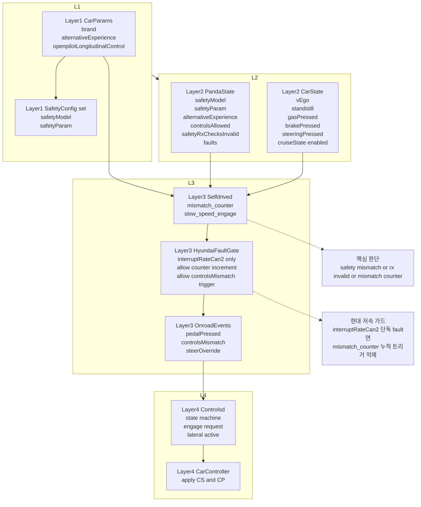

# 현대차 저속 Engage/Always Lateral On 이슈 교육 문서

## Diagram Type

- Mermaid `flowchart` 기반 Layered Data Flow Diagram
- 목적: 런타임 데이터가 어디서 생성되고 어떤 판단 경로를 거쳐 이벤트로 이어지는지 설명

## Layered Data Flow Diagram (Mermaid)

## panda란 무엇인가

`panda`는 openpilot의 차량 인터페이스 하드웨어/펌웨어 계층입니다.

- 차량 CAN 버스를 읽고/쓰기 하는 안전 경계 장치입니다.
- 어떤 제어를 허용할지(`controlsAllowed`)와 어떤 안전 모드를 사용할지(`safetyModel`, `safetyParam`)를 강제합니다.
- openpilot 프로세스는 `pandaStates`를 통해 현재 안전 상태를 관측하고, 불일치 시 `controlsMismatch`를 발생시킵니다.

쉽게 말해, `panda`는 "차량 제어가 안전 정책 안에서만 나가도록 막아주는 게이트"입니다.

## 이번 이슈와 연결해서 보기

이슈 목표:

- 현대차의 원래 기능인 저속(약 30km/h 미만) engage 특성과 always lateral on 사용성을 유지
- 동시에 안전 경계를 깨지 않기

관찰된 로그 패턴:

- `safetyModel/safetyParam/alternativeExperience`는 기대값과 일치
- `safetyRxChecksInvalid=False`
- `controlsAllowed=False` 상태가 유지되며 `faults=['interruptRateCan2']`가 반복
- 결과적으로 `mismatch_counter`가 한계에 도달하며 `controlsMismatch`가 발생

적용한 가드의 의미:

- 현대 + 저속 조건에서, `interruptRateCan2` 단독 fault일 때는
  - `mismatch_counter` 누적을 막고
  - 카운터 기반 `controlsMismatch` 트리거도 막음
- 단, 진짜 안전 불일치(`safety mismatch`)나 `safetyRxChecksInvalid`는 그대로 즉시 감지

즉, 이번 수정은 "안전 로직 해제"가 아니라 "특정 노이즈/경계 조건 오탐 억제"입니다.

## 유지보수 체크포인트

- 새 차량/하네스에서 `faults` 조합이 달라질 수 있으므로, 단독 fault 조건은 로그로 재검증 필요
- `controlsMismatch`가 다시 뜨면 아래 순서로 확인
  - `safetyModel/safetyParam/alternativeExperience` 일치 여부
  - `safetyRxChecksInvalid` 여부
  - `faults` 패턴이 단독인지 복합인지
- 복합 fault 또는 rx invalid가 보이면 가드를 넓히지 말고 원인(배선, 하드웨어, 버스 품질)을 우선 조사
