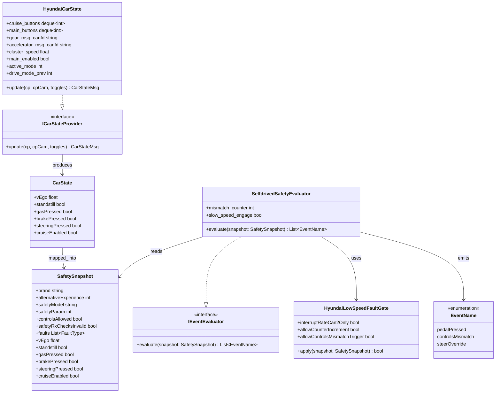

# 현대차 저속 Engage 이슈 인터페이스 중심 클래스 다이어그램

## Diagram Type

- UML Static Structure Diagram 중 Interface-centric Class Diagram
- 목적: C++/C# 스타일로 인터페이스, 구현체, 주요 필드 타입과 관계를 명확히 표현

## Interface-centric Class Diagram (Mermaid)

## 언제 이 다이어그램을 보나

- 유지보수자가 변수/타입 단위로 영향도를 확인할 때
- 인터페이스 경계(누가 구현하고 누가 소비하는지)를 추적할 때
- `controlsMismatch`가 어떤 필드 조합에서 발생하는지 정적 구조 관점으로 분석할 때
